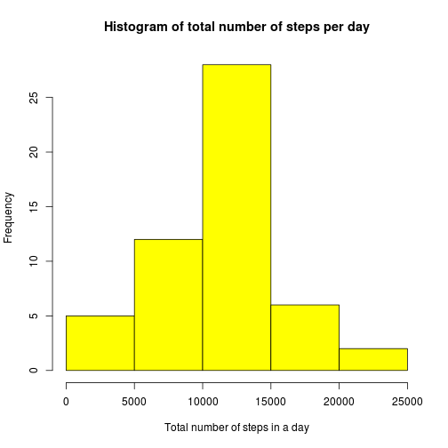

***

## Introduction and context
This document report the work done for the JohnsHopkins coursera course "Reproducible Research" Peer Assessment 1.

### The Assigmnent
The assignment makes use of data from a personal activity monitoring device. This device collects data at 5 minute intervals through out the day. The data consists of two months of data from an anonymous individual collected during the months of October and November, 2012 and include the number of steps taken in 5 minute intervals each day.

### The dataset
The variables included in the dataset are as follows:

* **steps**: Number of steps taking in a 5-minute interval (missing values are coded as NA)

* **date**: The date on which the measurement was taken in YYYY-MM-DD format

* **interval**: Identifier for the 5-minute interval in which measurement was taken

The dataset is stored in a comma-separated-value (CSV) file and there are a total of 17,568 observations in this dataset.

## Data loading and preprocessing
The dataset is first located, unzipped and downloadeD in a dataframe called `step`. No preprocessing has been carried out.


```r
## loading useful library
library(ggplot2)
## Loading file in dataframe "step"
fileurl <- "https://d396qusza40orc.cloudfront.net/repdata%2Fdata%2Factivity.zip"
tempdir = tempdir()
tempfile = tempfile(tmpdir=tempdir, fileext=".zip")
download.file(fileurl, tempfile, method="curl")
filename = unzip(tempfile, list=TRUE)$Name[1]
unzip(tempfile, files=filename, exdir=tempdir, overwrite=TRUE)
filepath = file.path(tempdir, filename)
step <- read.csv(filepath, as.is=TRUE)
```

## Mean total number of steps taken per day
Since the dataset contains some NA values a new working dataframe called `step2` is generated. Then a table containing number of steps per day is generated. 


```r
# generate dataframe called "step2" with complete cases only
step2 <- na.omit(step)
# aggregate steps as per date to get total number of steps in a day (no na values)
t.step.per.date <- aggregate(steps ~ date, step2, sum)
# set plotting area to 1 plot a time
par(mfrow = c(1, 1))
```

An histogram may now be plotted easily, showing that ,for instance, more than 25% of people tipically makes 1000-1500 steps a day.


```r
# create histogram of total number of steps in a day
hist(t.step.per.date$steps, main="Histogram of total number of steps per day", 
     xlab="Total number of steps in a day", col="yellow")
```

 

```r
# get mean and median total number of steps per day
avg<-mean(t.step.per.date$steps); med<-median(t.step.per.date$steps)
```
The  mean total number of step per day is 10766.19, where the median value is 10765.

## Pattern of daily activity


```r
# aggregate steps as interval to get average number of steps in an interval across all days
t.interval.steps <- aggregate(steps ~ interval, step2, mean)

# generate the line plot of the 5-minute interval (x-axis) and the average number of 
# steps taken, averaged across all days (y-axis)
with(t.interval.steps,plot(interval, steps, type='l', col="blue", 
     main="Average number of steps over all days", xlab="Interval", 
     ylab="Average number of steps"))
```

 

```r
peak_hour <- t.interval.steps[which.max(t.interval.steps$steps),1]*24/2400
```
Since the dataset contains 5-minutes interval a total of 288 interval data has been generated (`t.interval.steps`). It may be noted that there is a peak at 8.35 o'clock.

## Inputing missing values


```r
# find row id of maximum average number of steps in an interval
# get the interval with maximum average number of steps in an interval
t.interval.steps [which.max(t.interval.steps$steps),]
```

```
##     interval steps
## 104      835 206.2
```

```r
# get rows with NA's
step.na <- step[!complete.cases(step),]

# number of rows
nrow(step.na)
```

```
## [1] 2304
```

```r
# perform the imputation - put the closest valid value
for (i in 1:nrow(step)){
  if (is.na(step$steps[i])){
    value <- step$interval[i]
    row <- which(t.interval.steps$interval == value)
    steps.val <- t.interval.steps$steps[row]
    step$steps[i] <- steps.val
  }
}

# reaggregate steps per date
t.date.per.step.imputed <- aggregate(steps ~ date, step, sum)
```

Now it is possible to create the histogram based on estimated values.


```r
# create histogram of total number of steps in a day
hist(t.date.per.step.imputed$steps, col="green", 
     main="Histogram of total number of steps per day (Imputed)", 
     xlab="Total number of steps in a day")
```

 

```r
# get mean and median of total number of steps per day
mean(t.date.per.step.imputed$steps); median(t.date.per.step.imputed$steps)
```

```
## [1] 10766
```

```
## [1] 10766
```

```r
# get mean and median of total number of steps per day for data with NA's removed
mean(t.step.per.date$steps);median(t.step.per.date$steps)
```

```
## [1] 10766
```

```
## [1] 10765
```
## Differences in activity patterns between weekdays an weekend


```r
# convert and format date from string to Date class
step$date <- as.Date(step$date, "%Y-%m-%d")

# insert a new column indicating daytype (Weekday or Weekend) 
step$day <-  as.factor(ifelse(weekdays(step$date) %in% c("Saturday","Sunday"),  "weekend", "weekday"))

# reaggregate steps as interval to get average number of steps in an interval across all days
t.interval.step.imputed <- aggregate(steps ~ interval+day, step, mean)

# make the panel plot for weekdays and weekends
qplot(interval, steps, data=t.interval.step.imputed, geom=c("line"), xlab="Interval", 
      ylab="Number of steps", main="",colour=day) + facet_wrap(~ day, ncol=1) 
```

 

Analysis of day type shows relevant differencies in actiity as follows.
During **weekdays** the more intense period of acitivties is observed in the morning (between 6.00 and 9.00) with a pek of 250 steps at 8.35. During **weekend days** actiivties are more spread over the dayand the same is for peaks(8.30, 11.00, 16.30, etc).

